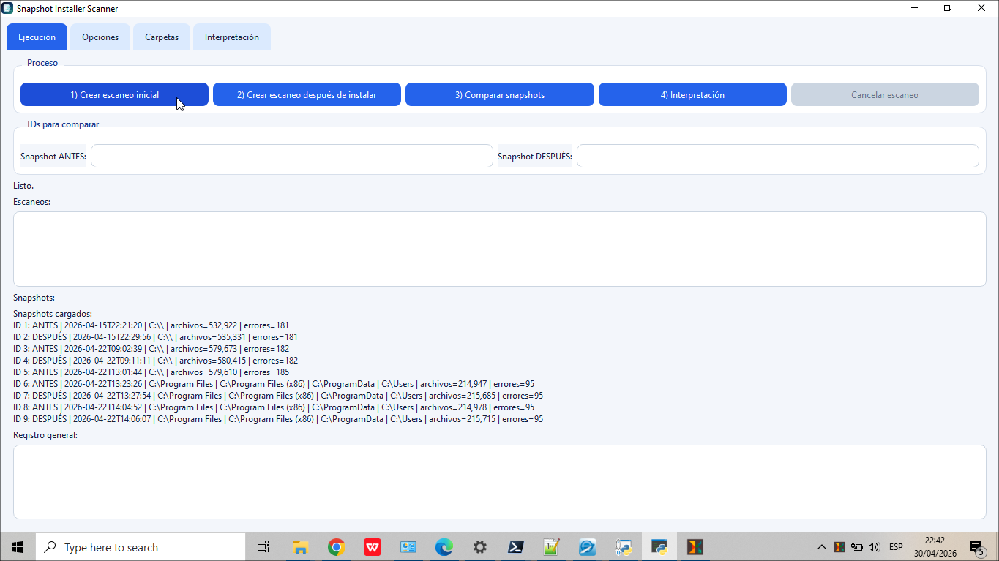

# Snapshot Installer Scanner (PyQt6)

Para Windows 10. Aplicación tipo “snapshot” para comparar el estado del sistema de archivos **antes y después** de instalar un programa.

## Qué hace
1. Crea un snapshot (escaneo) de una o varias carpetas.
2. Guarda el snapshot en una base de datos SQLite.
3. Crea un segundo snapshot.
4. Compara ambos snapshots y exporta resultados a CSV/TXT.
5. Genera una **interpretación** enfocada en las carpetas “principales” nuevas creadas (y los archivos nuevos fuera de esas carpetas).

## Información registrada
Por cada ruta encontrada se guarda:
- Ruta completa
- Si es archivo o carpeta
- Tamaño (archivos; para carpetas se guarda 0)
- `mtime` (fecha/hora de modificación)
- `ctime` (fecha/hora de cambio/creación según Windows)
- Modo/atributos básicos (`st_mode`)

Además:
- Errores de acceso durante el escaneo (se guardan en la base de datos)

## Interfaz (pestañas)
- **Ejecución**: botones del flujo (escaneo ANTES / escaneo DESPUÉS / comparar / interpretación) + logs.
- **Opciones**: ruta de base de datos SQLite, carpeta de exportación CSV, y etiquetas de snapshots.
- **Carpetas**: lista de carpetas a escanear (una por línea) y exclusiones (una por línea).
  - Botón **Cargar rutas recomendadas**: rellena sugerencias típicas (`Program Files`, `ProgramData`, `Users`, etc.) y exclusiones comunes (Temp, Recycle Bin, WER, etc.).
- **Interpretación**: resumen en texto + tabla con las carpetas principales nuevas detectadas.

## Requisitos
- Windows 10
- Python en el PATH
- PyQt6

## Instalación
Abre CMD o PowerShell y ejecuta:

```bash
pip install PyQt6
```

## Ejecución
En la carpeta del proyecto:

```bash
python snapshot_installer_scanner.py
```



## Flujo recomendado (tipo “antes/después”)
- Ejecuta la aplicación como **Administrador** si vas a escanear rutas amplias (por ejemplo `C:\`), para reducir errores por permisos.
- Ajusta en **Carpetas**:
  - **Carpetas a escanear** (una por línea). Si lo dejas vacío, se usa la “Ruta principal a escanear”.
  - **Carpetas excluidas** para acelerar y evitar ruido.
- Pulsa **1) Crear escaneo inicial**.
- Instala el programa que quieres analizar.
- Pulsa **2) Crear escaneo después de instalar**.
- Indica/valida los IDs ANTES y DESPUÉS y pulsa **3) Comparar snapshots**.
- Opcional: pulsa **4) Interpretación** (también se genera automáticamente al comparar).

## Comparación: qué exporta
Se crean en la carpeta de exportación:
- `cambios_creados_*.csv`: rutas nuevas (archivos y carpetas).
- `cambios_eliminados_*.csv`: rutas eliminadas.
- `cambios_modificados_*.csv`: rutas que cambiaron metadatos (tamaño/fechas/modo).
- `resumen_comparacion_*.txt`: resumen con conteos y nombres de archivos generados.

## Interpretación (carpetas principales nuevas)
Además de la comparación, se exporta:
- `interpretacion_carpetas_principales_*.csv`: carpetas “principales” nuevas con:
  - cantidad de archivos/carpetas creados dentro
  - tamaño total (suma de tamaños de archivos dentro)
  - fecha de la carpeta y fecha/hora del análisis
- `interpretacion_archivos_sueltos_*.csv`: archivos nuevos que **no** están dentro de las carpetas principales nuevas
- `interpretacion_*.txt`: reporte en texto con ranking de carpetas principales nuevas y listado (limitado) de archivos sueltos

## Funciones extra
- **Cancelar escaneo**: detiene el worker y guarda lo ya escaneado.
- **Escaneo “en vivo”**: muestra rutas que se van procesando mientras corre el escaneo.
- **SQLite con WAL**: la base de datos se inicializa automáticamente y guarda snapshots/archivos/errores.

## Notas importantes
- Escanear todo `C:\` puede tardar bastante dependiendo del disco y la cantidad de archivos.
- Algunos archivos del sistema pueden dar error de acceso; esos errores se registran.
- Esta versión detecta cambios por metadatos del sistema de archivos. **No calcula hash de contenido** para mantener el escaneo rápido.
